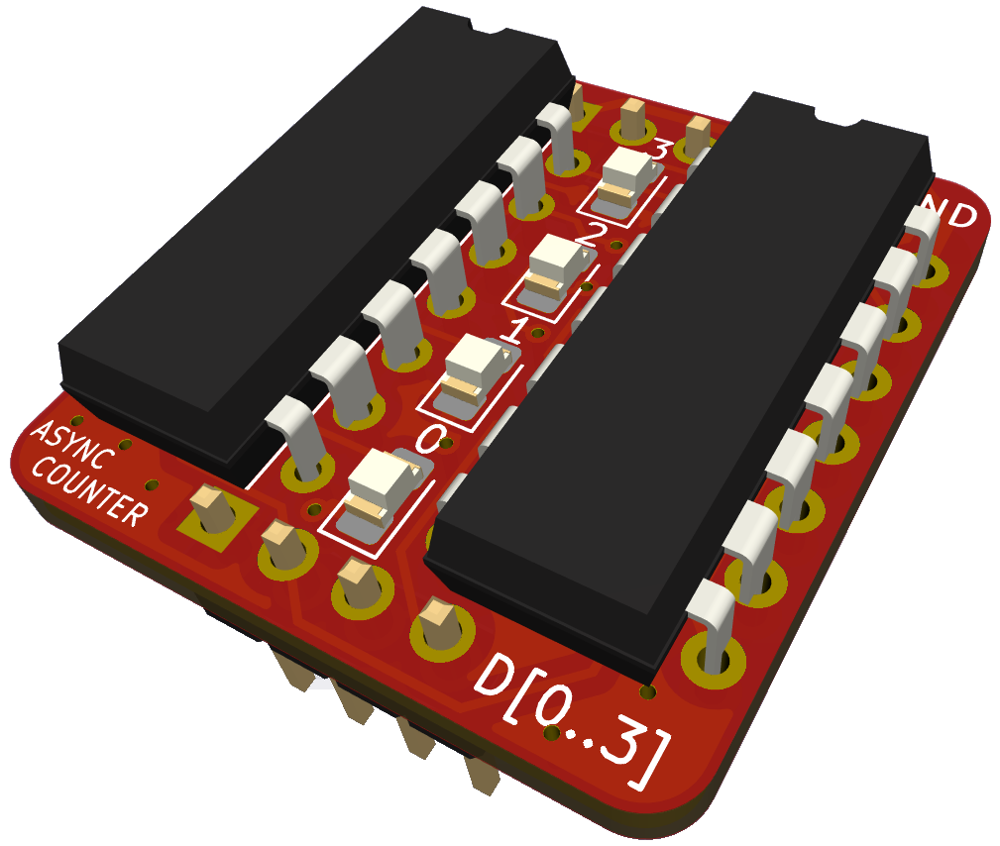
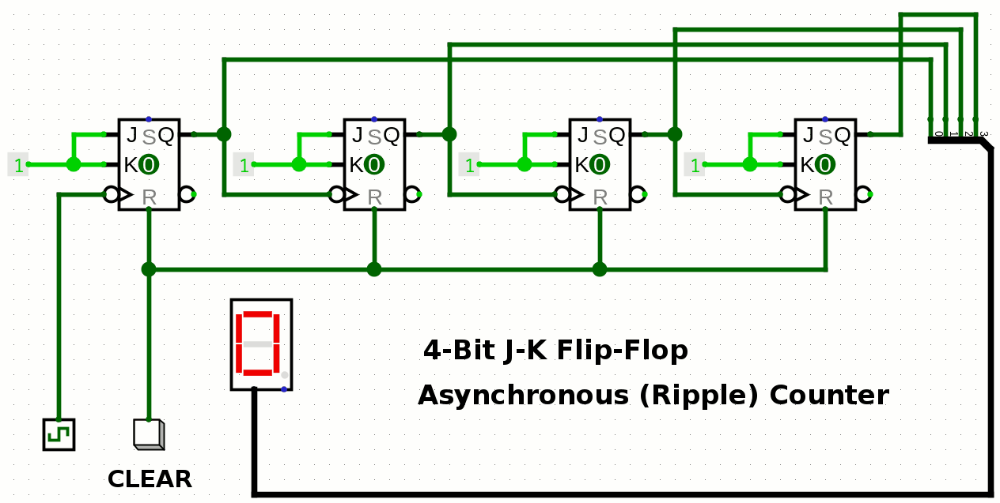

# 4-Bit J-K Flip-Flop Asynchronous (Ripple) Counter

An asynchronous counter built with J-K Flip-Flops, designed on a small PCB module suitable for breadboard circuits.

## Design Files

The board was created using KiCad, and the project files can be found in the `KiCad` directory. If you prefer to view the schematic without KiCad, a PDF version is available in the `schematic_pdf` directory.

## Gerber Files

All the necessary files for PCB fabrication are stored in the `fabrication_outputs` directory.

## Logisim Simulation

To see how the circuit works in a simulation, you can check the Logisim-evolution project file, which is available in the `Logisim` directory.

